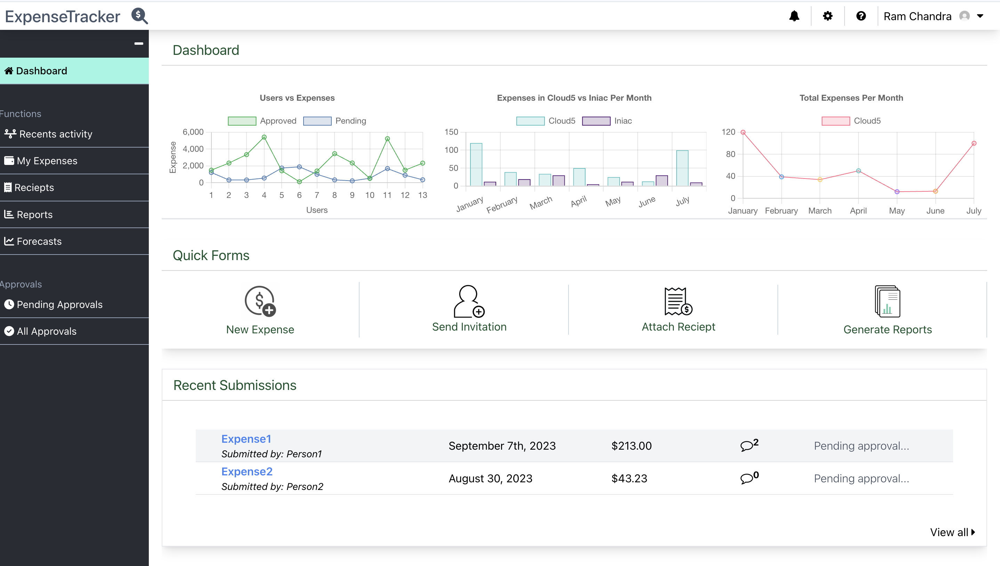

# Expense Tracker Repository

**Expense Tracker** is an internal tool designed to streamline the process of managing employee expenses. The system creates workflows that allow employees to submit expense requests with proof (image upload), while admins can review, approve, or reject them. Employees have the flexibility to re-upload proofs for rejected requests up to two times, ensuring an efficient and transparent process.

**Screenshot Dashboard**

## Features
1. **Role-Based Workflows**:
   - Employees: Submit expenses with image proof, track statuses, and re-upload proofs if needed.
   - Admins: Review, approve, or reject expenses and monitor trends via a dashboard.
2. **Proof Upload System**: Stores images organized by `year/month/day` for easy retrieval.
3. **JWT Authentication**:
   - Secure login with token validation, expiry checks, and tampering detection.
   - HTTPOonly cookies for enhanced security.
4. **Interactive Dashboard**:
   - Insights and trends to help admins make informed decisions.
5. **Performance Optimizations**:
   - DB sharding, indexing, and optimized queries using `select_related`, `prefetch_related`, `F()`, and aggregation.
6. **File Storage and Caching**:
   - Implements decorators for caching repetitive data requests.
   - Async handling for efficient backend processing.

## Technology Stack
- **Backend**: Python, Django, Django Rest Framework
- **Frontend**: ReactJS, TailwindCSS, Framer Motion
- **Database**: PostgreSQL with sharding and indexing
- **Authentication**: JWT with secure token storage in HTTPOnly cookies
- **Other Libraries/Tools**: Python Decouple, email-validator, font-awesome

## System Design Architecture
1. **Microservices-Inspired Architecture**:(as an enhancement)
   - Flexible for handling user authentication, expense submissions, and admin workflows.
2. **Data Flow**:
   - JWT validation on each request.
   - File uploads handled via a dedicated file storage service.
3. **Frontend Integration**:
   - ReactJS communicates with the backend using secure API endpoints.
   - Supports dynamic routing and state management with React Router.
4. **Caching**:
   - Caches repetitive user requests (e.g., monthly expenses) using decorators to improve efficiency.
5. **Scalability**:
   - DB optimization strategies like sharding and indexing for faster query responses.
   - Future plans to integrate lightweight backends like Flask or Gin for specific components.

## Possible Challenges
1. **JWT Management**:
   - Ensuring proper token validation and secure handling with cookies.
   - Managing token expiration gracefully without disrupting the user experience.
2. **File Storage**:
   - Handling large numbers of uploaded images efficiently while maintaining proper organization.
   - Avoiding storage bottlenecks during high submission loads.
3. **Database Optimization**:
   - Scaling the database to handle a growing number of records while maintaining query performance.
   - Balancing between read-heavy and write-heavy operations.
4. **Frontend Performance**:
   - Ensuring a smooth user experience with dynamic data rendering and animations.
   - Managing large datasets on the client side without compromising performance.
5. **User Experience**:
   - Simplifying workflows for employees and admins to reduce errors and improve usability.

This project demonstrates expertise in building secure, scalable, and user-friendly applications with end-to-end workflows, advanced optimizations, and a focus on real-world usability. 